# finite-automata-exercises
my school exercises for my finite automata class

---

## TD1

### 1

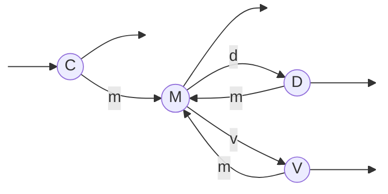

### 2

$a)$
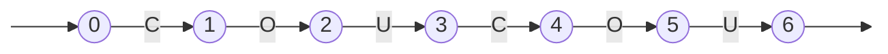
 
 

$b)$
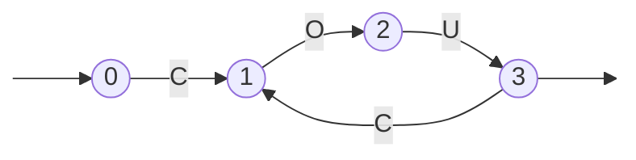
 
 
 

### 3

$a)$
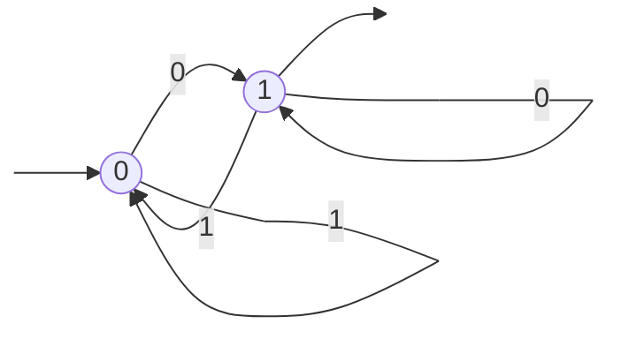
 
 

$b)$
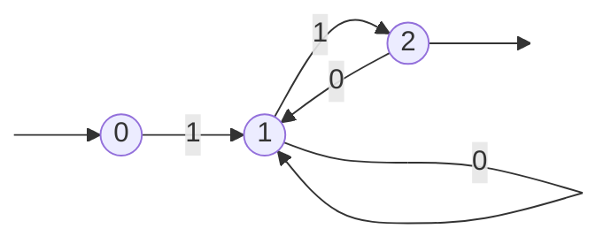
 
 

Soit P = point( . )

$c)$
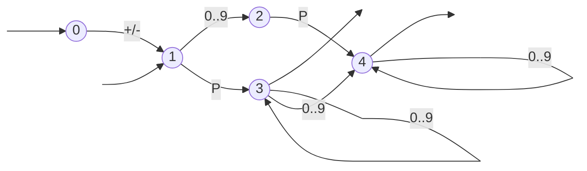
 
 

$d)$
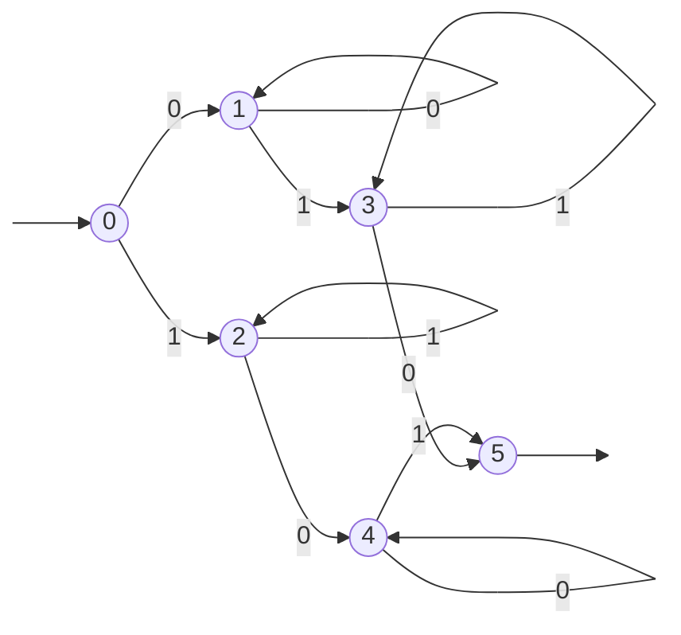
 
 

$e)$
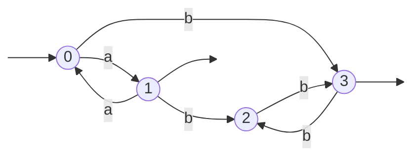
 
 
 

### 4

**Méthode de cours :**

| 7n % 7 | 14n % 7 | 14n+1 % 7 |
|:------:|:-------:|:---------:|
|        |    0    |     1     |
|        |         |           |
|    0   |    0    |     1     |
|    1   |    2    |     3     |
|    2   |    4    |     5     |
|    3   |    6    |     0     |
|    4   |    1    |     2     |
|    5   |    3    |     4     |
|    6   |    5    |     6     |

 

Tableau de transition :
| État |  0  |  1  |
|:----:|:---:|:---:|
|   0  |  0  |  1  |
|   1  |  2  |  3  |
|   2  |  4  |  5  |
|   3  |  6  |  0  |
|   4  |  1  |  2  |
|   5  |  3  |  4  |
|   6  |  5  |  6  |

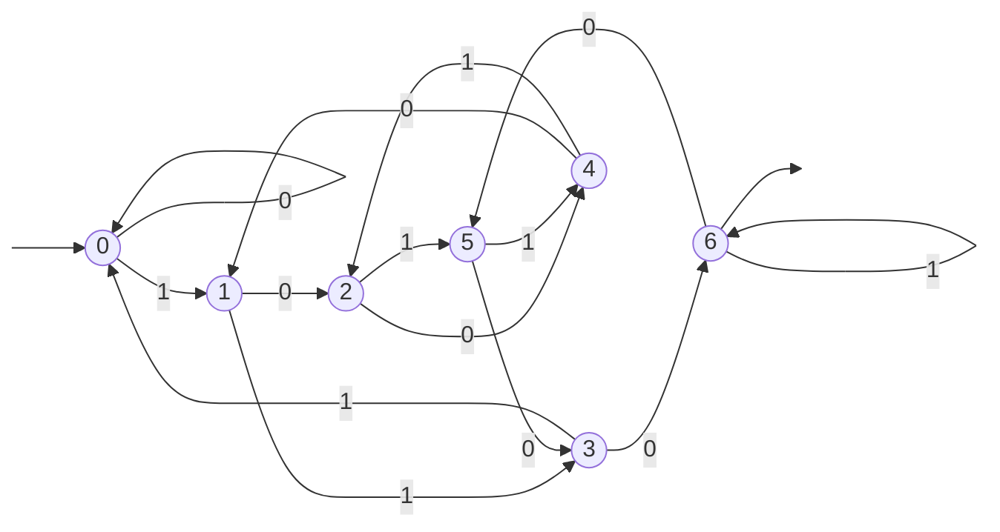
 
 
 

### 5

$a)$

Les mots reconnus par l'automate (chemin inverse):
{
    a,
    ab,
    bab,
    abbb,
    bbba,
    ...
}

Soit $B$ = $n$ $\cdot$ b, $n \in \mathbb{N^+}$

Donc l'automate reconnait les mots de la formes :  $B$ a $B$

Les états **1** et **3** sont inutile car inatteignable ou ne menant à rien.
 
 
 

### 6

Toutes les sous-questions
$a)$ ont comme réponse : `non standard`

Nous étudieront donc que les sous-questions $b)$ et $c)$

Nous nous permettrons de compléter les automates au besoin.

$6.1)$
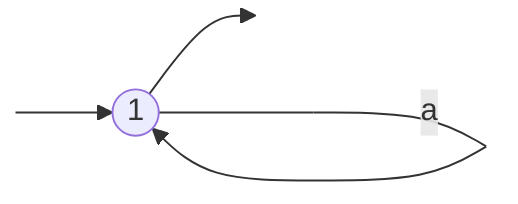

$b)$
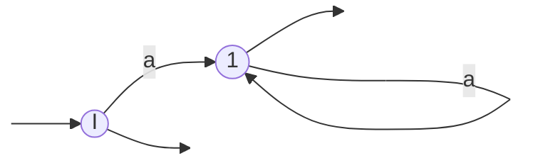
$c)$
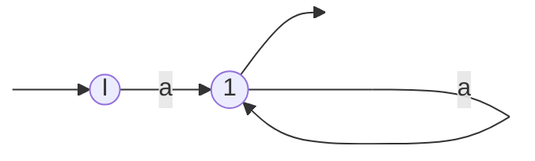

 
 

$6.2)$
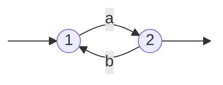

$b)$
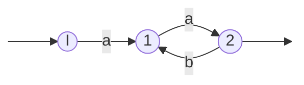
$c)$ Il ne reconnaît pas le mot vide.

 
 

$6.3)$
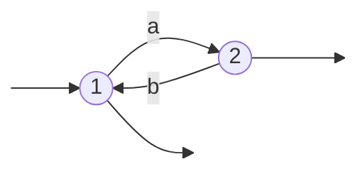

$b)$
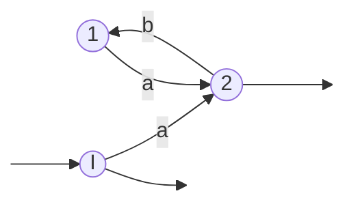
$c)$
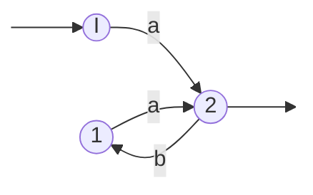

