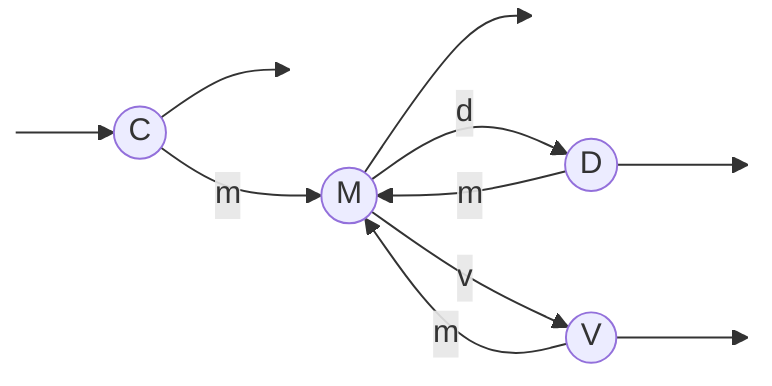
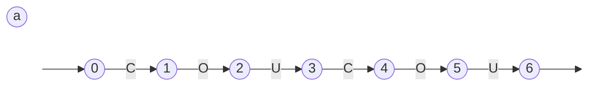
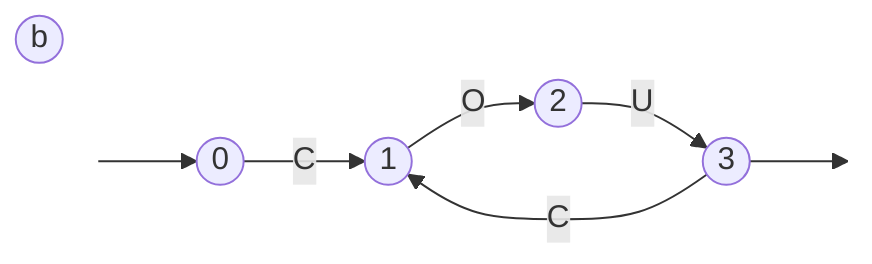

# finite-automata-exercises
my school exercises for my finite automata class

---

## TD1

### 1

```mermaid
graph LR
    START[ ] --> C((C)) --> STOP[ ]
    C --m--> M((M)) --> STOP2[ ]
    M --d--> D((D)) --> STOP3[ ]
    M --v--> V((V)) --> STOP4[ ]
    D --m--> M
    V --m--> M


    style START height:0px;
    style STOP  height:0px; 
    style STOP2 height:0px;
    style STOP3 height:0px;
    style STOP4 height:0px;
```

### 2

```mermaid
graph LR
a((a))

    START[ ] --> 0((0)) --C--> 1((1)) --O--> 2((2)) --U--> 3((3)) --C--> 4((4)) --O--> 5((5)) --U--> 6((6)) --> STOP[ ]


    style START height:0px;
    style STOP  height:0px; 
```

```mermaid
graph LR
a((b))

    START[ ] --> 0((0)) --C--> 1((1)) --O--> 2((2)) --U--> 3((3)) --> STOP[ ]
    3 --C--> 1

    style START height:0px;
    style STOP  height:0px; 
```