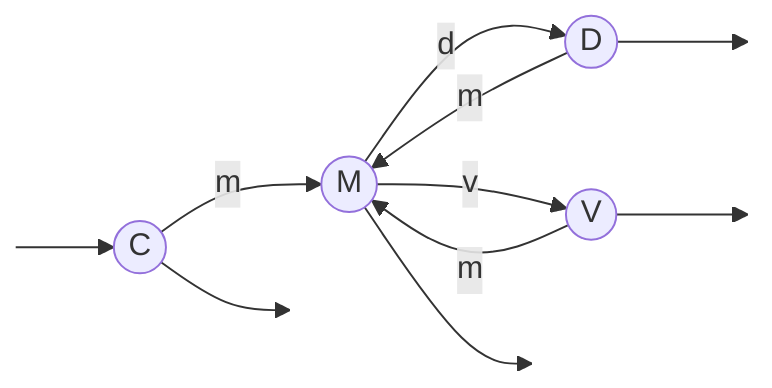
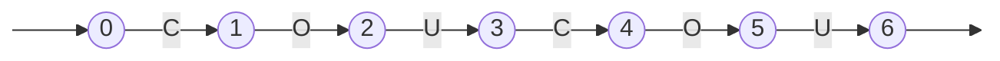
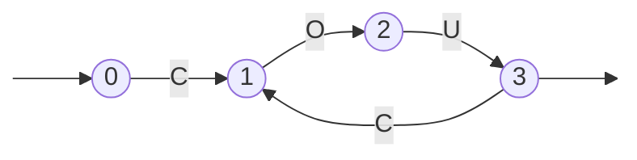
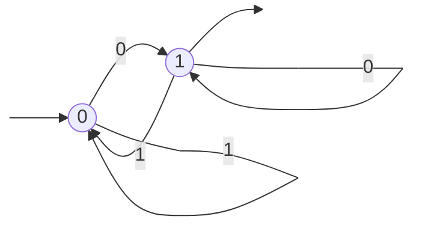
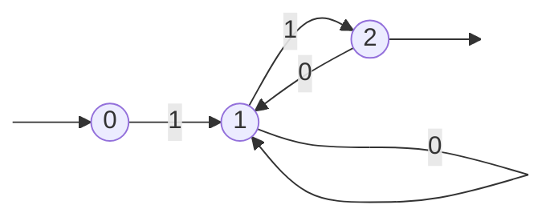

# finite-automata-exercises
my school exercises for my finite automata class

---

## TD1

### 1

```mermaid
graph LR
    C((C))
    M((M))
    D((D))
    V((V)) 

    ENTREE[ ] --> C 
    C --> SORTIE[ ]
    M --> SORTIE2[ ]
    D --> SORTIE3[ ]
    V--> SORTIE4[ ]


    C --m--> M
    M --d--> D
    M --v--> V
    D --m--> M
    V --m--> M


    style ENTREE height:0px;
    style SORTIE  height:0px; 
    style SORTIE2 height:0px;
    style SORTIE3 height:0px;
    style SORTIE4 height:0px;
```

### 2

(a)

```mermaid
graph LR
    0((0)) 
    1((1))
    2((2))
    3((3))
    4((4))
    5((5))
    6((6))

    ENTREE[ ] --> 0
    6 --> SORTIE[ ]


    0 --C--> 1
    1 --O--> 2
    2 --U--> 3
    3 --C--> 4
    4 --O--> 5
    5 --U--> 6


    style ENTREE height:0px;
    style SORTIE  height:0px; 
```
 
 

(b)

```mermaid
graph LR
    0((0)) 
    1((1))
    2((2))
    3((3))

    ENTREE[ ] --> 0
    3 --> SORTIE[ ]


    0 --C--> 1
    1 --O--> 2
    2 --U--> 3
    3 --C--> 1


    style ENTREE height:0px;
    style SORTIE  height:0px; 
```
 
 
 

### 3

(a)

```mermaid
graph LR
    0((0)) 
    1((1))

    ENTREE[ ] --> 0
    1 --> SORTIE[ ]
    
    0 --0--> 1
    1 --1--> 0
    
    0 --1--> 0
    1 --0--> 1


    style ENTREE height:0px;
    style SORTIE  height:0px; 
```
 
 

(b)

```mermaid
graph LR
    0((0)) 
    1((1))
    2((2))

    ENTREE[ ] --> 0 
    2 --> SORTIE[ ]


    0 --1--> 1 
    1 --1--> 2
    2 --0--> 1    
    1 --0--> 1


    style ENTREE height:0px;
    style SORTIE  height:0px; 
```
 
 

(c)

```mermaid
graph LR
    0((0)) 
    1((1))
    2((2))

    ENTREE[ ] --> 0 
    2 --> SORTIE[ ]


    0 --1--> 1 
    1 --1--> 2
    2 --0--> 1    
    1 --0--> 1


    style ENTREE height:0px;
    style SORTIE  height:0px; 
```