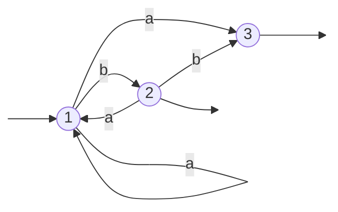
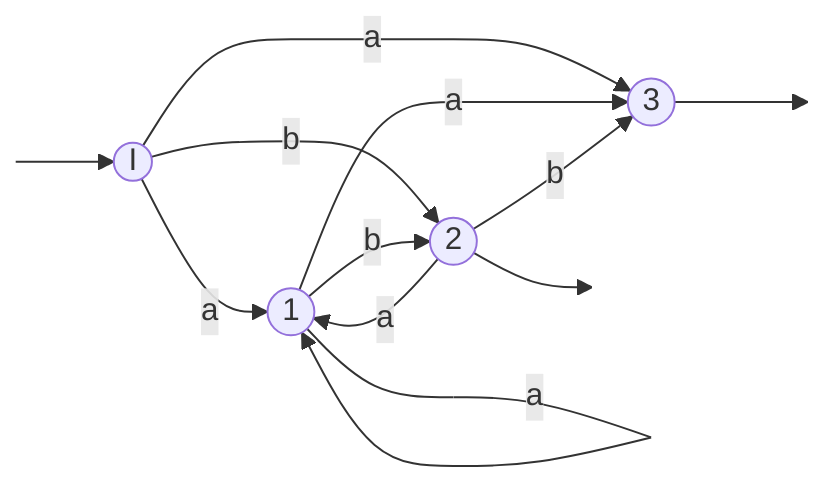
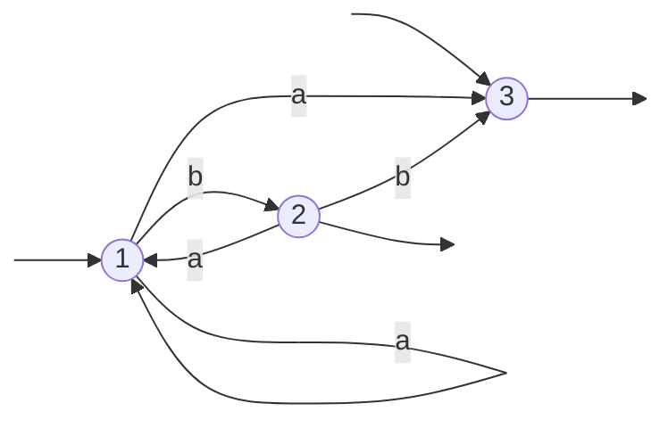

# finite-automata-exercises

my school exercises for my finite automata class

---

$\def\specialFrac#1#2{{\frac{x + #1}{y + #2}}}$

$\specialFrac{7}{z+3}$

## TD1

### 1


### 2

$a)$


</br>
</br>

$b)$ Standardisation


</br>
</br>
</br>

### 3

$a)$


</br>
</br>

$b)$ Standardisation


</br>
</br>

Soit P = point( . )

$c)$


</br>
</br>

$d)$


</br>
</br>

$e)$


</br>
</br>
</br>

### 4

**Méthode de cours :**

| 7n % 7 | 14n % 7 | 14n+1 % 7 |
|:------:|:-------:|:---------:|
|        |    0    |     1     |
|        |         |           |
|    0   |    0    |     1     |
|    1   |    2    |     3     |
|    2   |    4    |     5     |
|    3   |    6    |     0     |
|    4   |    1    |     2     |
|    5   |    3    |     4     |
|    6   |    5    |     6     |

<br>

Tableau de transition :


</br>
</br>
</br>

### 5

$a)$

Les mots reconnus par l'automate (chemin inverse):
{
a,
ab,
bab,
abbb,
bbba,
...
}

Soit $B$ = $n$ $\cdot$ b, $n \in \mathbb{N^+}$

Donc l'automate reconnait les mots de la formes :  $B$ a $B$

Les états **1** et **3** sont inutile car inatteignable ou ne menant à rien.
</br>
</br>
</br>

### 6

Toutes les sous-questions
$a)$ ont comme réponse : `non standard`

Nous étudieront donc que les sous-questions $b)$ Standardisation et $c)$

$6.1)$


$b)$ Standardisation


$c)$


<br>
<br>

$6.2)$


$b)$ Standardisation


$c)$ Il ne reconnaît pas le mot vide.

<br>
<br>

$6.3)$


$b)$ Standardisation


$c)$


<br>
<br>

$6.4)$



$b)$ Standardisation



$c)$ Il ne reconnaît pas le mot vide.

<br>
<br>

$6.5)$



$b)$ Standardisation

```mermaid
graph LR
    style ENTREE height:0px;
    style SORTIE  height:0px; 
    style SORTIE2  height:0px; 
    style SORTIE3  height:0px; 

    I((I)) 
    1((1))
    2((2))
    3((3))

    ENTREE[ ] --> I --> SORTIE[ ]
    2 --> SORTIE2[ ]
    3 --> SORTIE3[ ]


    I --a--> 1
    I --a--> 3
    I --b--> 2

    1 --a--> 1
    1 --a--> 3
    1 --b--> 2
    
    2 --a--> 1
    2 --b--> 3
```

$c) \\ $
$\\ cf.6.4) b)$

<br>
<br>

$6.6)$

```mermaid
graph LR
    style ENTREE height:0px;
    style ENTREE2 height:0px;
    style SORTIE  height:0px; 
    style SORTIE2  height:0px; 

    1((1))
    2((2))
    3((3))
    4((4))

    ENTREE[ ] --> 1 
    ENTREE2[ ] --> 3 
    2 --> SORTIE[ ]
    4 --> SORTIE2[ ]


    4 --b--> 3

    3 --a--> 2
    3 --a--> 4

    1 --a--> 2
    1 --b--> 4
```

$b)$ Standardisation

```mermaid
graph LR
    style ENTREE height:0px;
    style SORTIE  height:0px; 
    style SORTIE2  height:0px; 

    I((I)) 
    1((1))
    2((2))
    3((3))
    4((4))

    ENTREE[ ] --> I
    4 --> SORTIE[ ]
    2 --> SORTIE2[ ]


    I --a--> 2
    I --a/b--> 4

    4 --b--> 3

    3 --a--> 2
    3 --a--> 4

    1 --a--> 2
    1 --b--> 4
```

$c)$ Il ne reconnaît pas le mot vide.

<br>
<br>

$6.7)$

```mermaid
graph LR
    style ENTREE height:0px;
    style ENTREE2 height:0px;
    style SORTIE  height:0px; 
    style SORTIE2  height:0px; 
    style SORTIE3  height:0px; 

    1((1))
    2((2))
    3((3))
    4((4))

    ENTREE[ ] --> 1 
    ENTREE2[ ] --> 3 
    2 --> SORTIE[ ]
    4 --> SORTIE2[ ]
    3 --> SORTIE3[ ]


    4 --b--> 3

    3 --a--> 2
    3 --a--> 4

    1 --a--> 2
    1 --b--> 4
```

$b)$ Standardisation

```mermaid
graph LR
    style ENTREE height:0px;
    style SORTIE  height:0px; 
    style SORTIE2  height:0px; 
    style SORTIE3  height:0px; 

    I((I)) 
    1((1))
    2((2))
    3((3))
    4((4))

    ENTREE[ ] --> I --> SORTIE3[ ]
    4 --> SORTIE[ ]
    2 --> SORTIE2[ ]


    I --a--> 2
    I --a/b--> 4

    4 --b--> 3

    3 --a--> 2
    3 --a--> 4

    1 --a--> 2
    1 --b--> 4
```

$c) \\ $
$\\ cf.6.6) b)$

